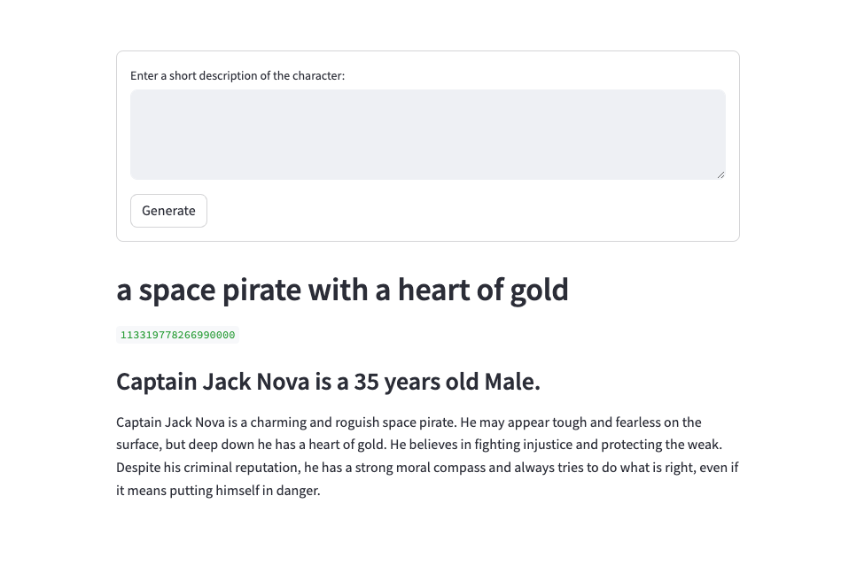

# CharacterGenerator

This is a short project showing how to using LLM function calls with a very short description to generate characters.

Try it at:

https://charactergenerator-rvvq6yy8l42uad77j4vzlq.streamlit.app/

## Tech Stack
dmanning23/CharacterGenerator is built on the following main stack:

- [Python](https://www.python.org) – Languages
- [OpenAI](https://openai.com/) – Large Language Models
- [Streamlit](https://streamlit.io) – Machine Learning Tools

Full tech stack [here](/techstack.md)
